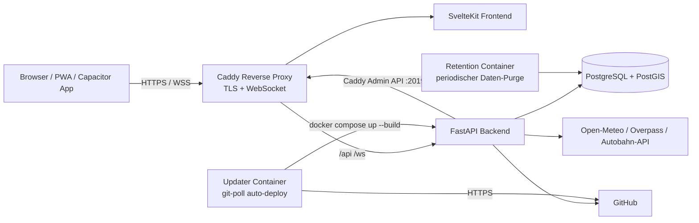

<p align="center">
  
</p>

<p align="center">
  <a href="LICENSE"></a>
  <a href="https://github.com/RettTechSolutions/ConvoyPlan/releases/latest"></a>
  <a href="https://github.com/RettTechSolutions/ConvoyPlan/actions/workflows/ci.yml"></a>
  <a href="https://github.com/RettTechSolutions/ConvoyPlan/issues"></a>
  <a href="https://github.com/RettTechSolutions/ConvoyPlan/pulls"></a>
</p>

<p align="center">
  <strong>Browserbasierte Planungssoftware für Marschverbände, Konvois und Einsatzfahrten von BOS-Organisationen.</strong>
</p>

<p align="center">
  Kartenbasierte Routenplanung · Live-Tracking · Marschbefehl-PDF · Self-hosted · Docker
</p>

---

## Inhaltsverzeichnis

- [Highlights](#highlights)
- [Funktionsumfang](#funktionsumfang)
- [Screenshots](#screenshots)
- [Architektur](#architektur)
- [Tech-Stack](#tech-stack)
- [Projektstruktur](#projektstruktur)
- [Quickstart](#quickstart)
- [Konfiguration](#konfiguration)
- [API-Übersicht](#api-übersicht)
- [Datenmodell](#datenmodell)
- [Entwicklung](#entwicklung)
- [Deployment](#deployment)
- [Native App / PWA](#native-app--pwa)
- [Sicherheitshinweise](#sicherheitshinweise)
- [Roadmap-Ideen](#roadmap-ideen)
- [Lizenz](#lizenz)
- [Beitragen](#beitragen)

---

## Highlights

- 🗺️ **Kartenbasierte Marschplanung** mit OpenStreetMap und MapLibre GL.
- 🚗 **Routing über GraphHopper** inklusive selbst gehosteter Routing-Engine im Docker-Setup.
- 🚒 **Fahrzeugverwaltung** mit Funkrufname, Kennzeichen, Abmessungen, Gewicht, Rolle und Kraftstoffdaten.
- 📍 **Wegpunkte, Kontrollpunkte und technische Halte** inklusive Haltezeiten und Zweck wie Tanken, Pause oder Wartung.
- ⏱️ **Automatische Zeitplanung** anhand von Startzeit, Marschgeschwindigkeiten und Halten.
- 📄 **Marschbefehl-PDF** sowie GPX- und JSON-Export für Weitergabe und Nachbearbeitung.
- 📡 **Live-Tracking per WebSocket** mit Browser-Geolocation und Fahrzeugstatus. Projiziert sendende Fahrzeuge auf die Route und meldet mit Ton/Vibration, sobald die Spitze des Verbands einen Wegpunkt oder Leitstellenwechsel erreicht – inkl. Fortschrittszähler, bis der gesamte Verband durch ist.
- 🔐 **Organisations- und Rollenmodell** für Admins, Planer, Fahrer und Beobachter.
- 🌤️ **Wetter- und Verkehrsdaten-Integration** – Wetter über Open-Meteo sowie Sperrungen und Baustellen aus mehreren Quellen: OpenStreetMap/Overpass, der offiziellen Autobahn-API (autobahn.api.bund.dev), lizenzfreien offenen Baustellenfeeds (MobiData BW, Berlin VIZ) und optional DATEX-II-Feeds der mobilithek (bundesweite Länder-Feeds, auch mTLS-geschützt); fällt eine Quelle aus, liefern die anderen weiter Ergebnisse.
- 🚦 **Live-Verkehrslage (Stau)** – optionale Anbindung an HERE oder TomTom: sobald eine Installation ihren eigenen API-Key hinterlegt (Admin-UI oder Env), wird die Fließgeschwindigkeit entlang der Route als Ampel-Ebene (grün→rot) über die Karte gelegt; ohne Key bleibt die Funktion vollständig inaktiv.
- 📱 **PWA und Capacitor-Konfiguration** für installierbare Web-App und native App-Wrapper.
- 🎨 **Branding-System** – eigenes Logo, Farben und App-Name über den Admin-Bereich konfigurierbar.
- 🏢 **Multi-Tenancy** – Organisationen erhalten einen kurzen Org-Code (4–8 Zeichen) als URL-Slug unter dem Scope `/o/[slug]/`; org-spezifische Login-Seite mit eigenem Branding; vollständige Datenisolation pro Organisation.
- 🔒 **MFA / TOTP** – Zwei-Faktor-Authentifizierung per TOTP (z. B. Google Authenticator) einrichtbar im Org-Admin-Panel.
- 📧 **SMTP-Dienst** – Passwörter direkt per E-Mail an Benutzer versenden; konfigurierbar im Admin-Panel ohne Neustart.
- 🔄 **Auto-Updater** – Docker-Container pollt das Repository und deployt neue Commits automatisch; Live-Update-Log per SSE im Browser. Update-Modus „Automatisch" (Standard) oder „Benachrichtigen" (nur E-Mail an Superadmins statt Auto-Install) sowie funktionierender Beta-Kanal auch bei image-basierten Standard-Installationen.
- 🔑 **Lizenzmodell mit Demo-Modus** – ohne gültigen Lizenzschlüssel läuft die App im Demo-Modus (Lesezugriffe uneingeschränkt, schreibende Operationen mit HTTP 402 gesperrt); Aktivierung direkt über Admin-UI.
- 🛡️ **Security-Härtung** – Brute-Force-Schutz (Rate-Limiting), einheitliche Passwort-Policy mit Have-I-Been-Pwned-Breach-Check, JWT-Revocation (Sitzungsentzug), MFA-Secrets verschlüsselt at-rest, CORS-Lockdown, Content-Security-Policy und Security-Header über Caddy.
- 📝 **Security-Audit-Log** – append-only Protokoll sicherheitsrelevanter Ereignisse (Logins, MFA, Passwortänderungen, Benutzer-/Org-Anlage, Lizenzaktivierung) inkl. Akteur, Ziel, IP und User-Agent.
- 🗂️ **DSGVO-Werkzeuge** – Datenexport (Art. 15) und Löschung mit pseudonymisiertem Audit-Trail (Art. 17) im Admin-Portal; automatische Datenaufbewahrung (Retention-Container) für Live-Positionen, Audit-Log und widerrufene Share-Links.
- 💾 **Backup & Restore** – Skripte für PostgreSQL-Dump plus Upload-/TLS-Volumes inkl. Prüfsummen, Retention und Restore; dokumentierter Verschlüsselung-at-rest-Leitfaden.
- 📞 **Org-fähige Leitstellen** – globale (superadmin-gepflegte) und org-eigene Leitstellen mit Vorschlags- und Freigabe-Workflow, Übersichtskarte und Landkreis-Auswahl für Zuständigkeitsgebiete. Sequenzielle Kanalwechsel-Kette mit „Convoy Anmeldung" am Start sowie Zusatzkanälen (weitere Funkgruppen) je Leitstelle in Zeitplan, Marschbefehl-Formular und PDF.
- 🧭 **Geführte Onboarding-Tour** – Spotlight-Tour direkt in der App, die reale Bedienelemente hervorhebt statt zentrierter Erklär-Dialoge.

---

## Funktionsumfang

### 🗺️ Planung und Routing

| Funktion | Beschreibung | Status |
|---|---|---:|
| Karte | Interaktive OSM-Karte mit Planungsansicht | ✅ |
| Wegpunkte | Start, Ziel, Wegpunkte, Kontrollpunkte und technische Halte | ✅ |
| Routenberechnung | GraphHopper-Routing über selbst gehosteten Dienst | ✅ |
| Zeitplan | Automatische Ankunfts- und Abfahrtszeiten | ✅ |
| Marschgeschwindigkeiten | Separate innerörtliche und außerörtliche Geschwindigkeit | ✅ |
| Kraftstoffplanung | Fahrzeugdaten und Tankstellenabfrage entlang der Route | ✅ |

### 👥 Verwaltung und Zusammenarbeit

| Funktion | Beschreibung | Status |
|---|---|---:|
| Login | Registrierung und JWT-basierte Authentifizierung | ✅ |
| Onboarding-Tour | Geführte Spotlight-Tour hebt reale Bedienelemente direkt in der App hervor | ✅ |
| Fahrzeuge | CRUD für Einsatzfahrzeuge und Konvoirollen | ✅ |
| Marschverbände | CRUD für Konvois und zugeordnete Fahrzeuge | ✅ |
| Teilverbände | Sub-Convoys mit Parent-Konvoi | ✅ |
| Mandanten | Organisationen mit Mitgliederverwaltung | ✅ |
| Multi-Tenancy | Org-Code-Slug, org-spezifische Login-Seite, Branding und Datenisolation pro Org | ✅ |
| Rollen | Admin, Planer, Fahrer und Beobachter | ✅ |
| MFA / TOTP | Zwei-Faktor-Authentifizierung per TOTP im Org-Admin-Panel einrichtbar | ✅ |
| SMTP-Dienst | Passwort-E-Mails direkt aus dem Admin-Panel versenden | ✅ |
| Freigabelink | Öffentliche Routenansicht per Share-Token | ✅ |
| Branding | Eigenes App-Logo, Farben und Name über Admin-UI konfigurierbar | ✅ |
| Leitstellen | Leitstellen und Kanalwechselpunkte entlang der Route | ✅ |
| Org-Leitstellen | Org-eigene Leitstellen mit Vorschlags-/Freigabe-Workflow, Übersichtskarte und Landkreis-Auswahl | ✅ |
| API-Schlüssel | Org-gebundene API-Keys für programmatischen Zugriff (Admin-Panel) | ✅ |

### 📡 Live und Export

| Funktion | Beschreibung | Status |
|---|---|---:|
| Live-Tracking | Positionsupdates per REST und WebSocket | ✅ |
| Fahrzeugstatus | Geplant, unterwegs, angekommen oder verspätet | ✅ |
| Wetter | Integration über Open-Meteo ohne API-Key | ✅ |
| Sperrungen | Sperrungen und Baustellen aus Overpass API, Autobahn-API (bund.dev), offenen regionalen Feeds (MobiData BW, Berlin VIZ) und optional DATEX-II/mobilithek, entlang der gesamten Route | ✅ |
| Verkehrslage | Live-Fließgeschwindigkeit/Stau über HERE oder TomTom entlang der Route (optionaler API-Key pro Installation) | ✅ |
| PDF | Marschbefehl als PDF | ✅ |
| GPX / JSON | Export und Import für Navigation, Dokumentation und Weiterverarbeitung | ✅ |
| PWA | Installierbare Web-App mit Tile-Caching | ✅ |
| Native Wrapper | Capacitor-Konfiguration für Android und iOS | ✅ |

### ⚙️ Betrieb und Administration

| Funktion | Beschreibung | Status |
|---|---|---:|
| Setup-Wizard | Ersteinrichtung per Browser ohne SSH-Zugang (4 Schritte inkl. Branding) | ✅ |
| Admin-Bereich | Benutzer- (inkl. optionalem Vor-/Nachname), Leitstellen- und Branding-Verwaltung | ✅ |
| Auto-Updater | Git-Polling-Container aktualisiert die Instanz automatisch bei neuem Commit | ✅ |
| Update-Status | Admin-UI zeigt Deploy-SHA und GitHub-Stand; manueller Trigger per Button | ✅ |
| Update-Kanal | Umschaltbar zwischen „Stable" (nur veröffentlichte Releases) und „Beta" (jeder Commit auf `main`, auch bei image-basierten Installationen) im Admin-Bereich | ✅ |
| Update-Modus | „Automatisch" installiert Updates selbstständig; „Benachrichtigen" verschickt nur eine E-Mail an Superadmins, Installation erfolgt manuell; optionale Bestätigungs-Mail nach automatischer Installation | ✅ |
| Live-Update-Log | Echtzeit-Ausgabe des Updater-Prozesses im Browser via SSE | ✅ |
| GitHub-Token in UI | `GITHUB_TOKEN` für Update-Fetch direkt in der Admin-UI konfigurierbar, kein Neustart | ✅ |
| Demo-Modus | Ohne Lizenzschlüssel: Lesezugriff uneingeschränkt, Schreibzugriff gesperrt (HTTP 402) | ✅ |
| Lizenzaktivierung | Schlüsseleingabe und Instanz-UUID im Admin-Bereich „System"; Cache-Reset ohne Neustart | ✅ |
| Backup / Restore | `scripts/backup.sh` und `scripts/restore.sh` für DB-Dump und Volumes inkl. Prüfsummen und Retention | ✅ |
| Host-Watchdog | systemd-Timer räumt verwaiste Updater-Container auf und startet abgestürzte Updater neu | ✅ |

### 🔐 Sicherheit und Datenschutz

| Funktion | Beschreibung | Status |
|---|---|---:|
| Brute-Force-Schutz | Rate-Limiting auf Login, MFA-Verify und Passwort-Reset (HTTP 429) | ✅ |
| Passwort-Policy | Mind. 10 Zeichen mit Buchstaben + Ziffern, Abgleich gegen Have-I-Been-Pwned | ✅ |
| JWT-Revocation | `token_version` entzieht alle Tokens bei Passwort-/MFA-Reset | ✅ |
| MFA at-rest | TOTP-Secrets mit Fernet verschlüsselt gespeichert | ✅ |
| CORS-Lockdown | In Produktion auf die eigene App-Origin beschränkt | ✅ |
| CSP & Security-Header | Content-Security-Policy (Report-Only/Enforce) plus HSTS, X-Content-Type-Options u. a. über Caddy | ✅ |
| Audit-Log | Append-only Protokoll sicherheitsrelevanter Ereignisse für Superadmins | ✅ |
| Datenexport (DSGVO Art. 15) | `GET /api/admin/users/{id}/export` liefert alle personenbezogenen Daten als JSON | ✅ |
| Datenlöschung (DSGVO Art. 17) | Löscht den Benutzer und pseudonymisiert den Audit-Trail | ✅ |
| Retention | `retention`-Container purgt Live-Positionen, Audit-Log und Share-Links nach Frist | ✅ |
| security.txt | Vulnerability-Disclosure-Kontakt unter `/.well-known/security.txt` | ✅ |
| Dependency-Scanning | Dependabot + CI-Job (`pip-audit`, `npm audit`) | ✅ |

---

## Screenshots

Screenshots folgen. Logo- und Design-Assets liegen unter [`logo/`](logo/):

| Asset | Datei |
|---|---|
| Hauptlogo | `logo/Hauptlogo.svg` / `logo/Hauptlogo.png` |
| Horizontales Logo | `logo/Logo Horizontal.svg` / `logo/Logo Horizontal.png` |
| Favicon | `logo/Favicon.svg` / `logo/Favicon.png` |
| Designgrafik | `logo/ConvoyPlan_Design.png` |

---

## Architektur



- **Caddy** terminiert TLS (Let's Encrypt oder eigenes Zertifikat), leitet `/api/*` und `/ws/*` ans Backend und alles andere ans Frontend. Die Konfiguration kann per Admin-API live neu geladen werden.
- Das **Frontend** stellt Login, Setup-Wizard, Planung, Karte, Live-Tracking und öffentliche Freigabelinks bereit.
- Das **Backend** bündelt Authentifizierung, Geschäftslogik, Routing-Aufbereitung, Exporte, Integrationen und die Caddy-Konfiguration.
- **PostgreSQL mit PostGIS** speichert Nutzer, Fahrzeuge, Konvois, Geometrien, Positionen und Systemeinstellungen.
- **GraphHopper** läuft selbst gehostet und verarbeitet beim ersten Start die gewählte OSM-PBF-Datei.

---

## Tech-Stack

| Schicht | Technologie |
|---|---|
| Frontend | SvelteKit, Svelte 5, TypeScript, Vite |
| Karte | MapLibre GL, OpenStreetMap |
| PWA | `@vite-pwa/sveltekit`, Workbox |
| Native App | Capacitor-Konfiguration |
| Backend | Python 3.12, FastAPI, Uvicorn |
| Datenbank | PostgreSQL 15, PostGIS |
| ORM / Migrationen | SQLAlchemy Async, Alembic |
| Authentifizierung | JWT, `python-jose`, `passlib` |
| Routing | GraphHopper 9.1 |
| Geodaten | GeoAlchemy2, Shapely, GeoJSON |
| Exporte | GPXPy, fpdf2, JSON |
| Externe Daten | Open-Meteo, OpenStreetMap Overpass API, Autobahn-API (autobahn.api.bund.dev), offene Baustellenfeeds (MobiData BW, Berlin VIZ), DATEX-II/mobilithek, HERE/TomTom Traffic Flow (optional) |
| Reverse Proxy / TLS | Caddy 2 (Let's Encrypt, eigenes Zertifikat, intern) |
| Infrastruktur | Docker Compose, Portainer Stack |

---

## Projektstruktur

```text
ConvoyPlan/
├── backend/
│   ├── app/
│   │   ├── api/routes/       # REST- und WebSocket-Endpunkte
│   │   │   ├── auth.py       # Registrierung, Login, MFA, Passwort-Reset
│   │   │   ├── setup.py      # Ersteinrichtungs-Wizard (Status + Ausführen)
│   │   │   ├── admin.py      # Superadmin: Benutzer, Orgs, API-Keys, Audit-Log, DSGVO
│   │   │   ├── leitstellen.py  # Globale Leitstellen und Kanalwechsel
│   │   │   ├── org_leitstellen.py  # Org-eigene Leitstellen + Vorschlags-Workflow
│   │   │   ├── branding.py   # Branding-Konfiguration und Logo-Upload
│   │   │   ├── email_template.py  # E-Mail-Vorlagen (SMTP-Versand)
│   │   │   ├── license.py    # Lizenzstatus, Aktivierung, Instanz-UUID
│   │   │   ├── convoys.py    # Marschverbände, Waypoints, Export
│   │   │   ├── share_links.py  # Widerrufbare Freigabelinks pro Konvoi
│   │   │   ├── track.py      # Eigenständige Tracking-App (REST + WebSocket)
│   │   │   ├── vehicles.py   # Fahrzeugverwaltung
│   │   │   ├── organizations.py  # Organisationen und Mitglieder
│   │   │   ├── tracking.py   # Live-Positionen + WebSocket
│   │   │   ├── routing.py    # GraphHopper-Routing
│   │   │   ├── weather.py    # Open-Meteo-Integration
│   │   │   ├── overpass.py   # Sperrungsabfragen (Overpass, Autobahn-API, offene Feeds, DATEX-II), Punkt und Routenkorridor
│   │   │   ├── traffic.py    # Live-Verkehrslage (HERE/TomTom), Punkt und Routenkorridor
│   │   │   ├── users.py      # Eigenes Benutzerprofil
│   │   │   ├── version.py    # Versions- und Build-Informationen
│   │   │   └── status.py     # Systemstatus
│   │   ├── models/           # SQLAlchemy-Modelle
│   │   ├── schemas/          # Pydantic-Schemas
│   │   ├── services/         # Routing, Zeitplan, Export, Wetter, Overpass/Autobahn/Traffic, Tracking, Retention
│   │   ├── jobs/             # Hintergrundjobs (z. B. Retention-Purge)
│   │   ├── config.py         # Backend-Konfiguration über Umgebungsvariablen
│   │   ├── database.py       # Async-Datenbankanbindung
│   │   └── main.py           # FastAPI-App und Router-Registrierung
│   ├── alembic/              # Datenbankmigrationen (0001–0026)
│   ├── tests/                # pytest-Tests
│   ├── Dockerfile
│   └── requirements.txt
├── frontend/
│   ├── src/lib/api/          # API-Client
│   ├── src/lib/components/   # Karte, Wetter, Leitstellen-Tabelle/-Karte, UI-Bausteine
│   ├── src/lib/stores/       # Auth-, Karten-, Konvoi-, Tracking-, Org-, Branding-Stores
│   ├── src/routes/
│   │   ├── setup/            # Ersteinrichtungs-Wizard (5 Schritte inkl. Org-Anlage)
│   │   ├── admin/            # Superadmin (self-gated): Benutzer, Orgs, API-Keys, Leitstellen, Branding, System
│   │   ├── o/[slug]/         # Org-Scope (alle org-spezifischen Routen)
│   │   │   ├── login/        # Org-spezifische Anmeldung mit eigenem Branding
│   │   │   ├── plan/         # Planungsansicht mit Karte
│   │   │   ├── tracking/     # Live-Tracking-Ansicht (Übersicht + je Konvoi)
│   │   │   └── admin/        # Org-Admin: Mitglieder, Leitstellen, Branding, System
│   │   ├── track/[slug]/     # Eigenständige Fahrer-Tracking-PWA („Convoy Tracking")
│   │   └── share/[token]/    # Öffentliche Routenansicht ohne Login
│   ├── static/geo/           # Offline-Landkreisgrenzen (GeoJSON) für Leitstellengebiete
│   ├── capacitor.config.ts
│   ├── package.json
│   └── vite.config.ts
├── docker/updater/           # Git-Polling-Container (update.sh, Dockerfile)
├── caddy/
│   └── entrypoint.sh         # Caddyfile-Generierung aus Env-Variablen
├── graphhopper/
│   ├── Dockerfile
│   ├── entrypoint.sh         # OSM-Download und GraphHopper-Start
│   └── config.yml
├── .github/
│   ├── workflows/
│   │   ├── ci.yml            # Tests + Typecheck + Docker-Build + Dependency-Audit
│   │   └── release.yml       # Docker-Images zu GHCR + GitHub Release bei Tag
│   └── dependabot.yml        # Dependency-Updates (pip/npm/Actions/Docker)
├── docs/                     # Backup/Restore, Retention- und ISO-Dokumentation
├── .hooks/pre-commit         # Lokaler Pre-Commit-Hook (ruff + svelte-check)
├── scripts/
│   ├── install.sh            # Linux-Installer (+ systemd-Watchdog)
│   ├── install.ps1           # Windows-Installer
│   ├── backup.sh             # PostgreSQL-Dump + Volumes + Prüfsummen + Retention
│   ├── restore.sh            # Wiederherstellung aus Backup
│   ├── updater-watchdog.sh   # Räumt verwaiste Updater-Container auf
│   ├── deploy.sh             # Einmalige Server-Migration / Notfall-Deploy
│   └── install-hooks.sh      # Installiert .hooks/ in .git/hooks/
├── logo/                     # Logo-, Favicon- und Design-Assets
├── CHANGELOG.md              # Versionshistorie
├── RELEASING.md              # Anleitung zum Schneiden eines Releases
├── SECURITY.md               # Vulnerability-Disclosure-Richtlinie
├── .env.example              # Alle Umgebungsvariablen mit Erklärungen
└── docker-compose.yml        # Compose-Datei für Entwicklung und Produktion (wird vom Installer genutzt)
```

---

## Quickstart

### Schnellinstallation (empfohlen)

**Linux:**

```bash
curl -sSL https://convoyplan.de/install.sh | bash
```

**Windows (PowerShell als Administrator):**

```powershell
irm https://convoyplan.de/install.ps1 | iex
```

Der Installer prüft Voraussetzungen (Docker, Docker Compose), fragt interaktiv nach Domain, E-Mail, Datenbankpasswort und OSM-Region, generiert einen `JWT_SECRET` automatisch und startet den Stack. Nach Abschluss öffnet sich der Setup-Wizard unter `https://<DOMAIN>/setup`.

**Voraussetzungen:** Docker Engine (Linux) oder Docker Desktop (Windows) muss installiert und gestartet sein.

---

### Manuelle Installation (Entwicklung / Portainer)

#### Voraussetzungen

- Git
- Docker und Docker Compose Plugin
- Node.js 20+ und npm für das Frontend
- Optional: Python 3.12 für lokale Backend-Entwicklung ohne Container

### 1. Repository klonen

```bash
git clone https://github.com/RettTechSolutions/ConvoyPlan.git
cd ConvoyPlan
```

### 2. Backend, Datenbank und GraphHopper starten

```bash
docker compose up -d --build
```

Beim ersten Start lädt GraphHopper die konfigurierte OSM-PBF-Datei herunter und baut daraus den Routing-Graphen. Der Standard ist Deutschland und kann mehrere Gigabyte groß sein. Für schnelle lokale Tests empfiehlt sich eine kleinere Region wie Berlin.

Logs verfolgen:

```bash
docker compose logs -f graphhopper
```

Gesundheitschecks prüfen:

```bash
curl http://localhost:8000/health
curl http://localhost:8989/health
```

### 3. Kleinere Testregion konfigurieren

Für einen schnelleren Start kann in `docker-compose.yml` beispielsweise Berlin gesetzt werden:

```yaml
OSM_DOWNLOAD_URL: https://download.geofabrik.de/europe/germany/berlin-latest.osm.pbf
OSM_FILENAME: berlin-latest.osm.pbf
```

Nach einer Änderung der OSM-Datei sollte der GraphHopper-Graph-Cache neu aufgebaut werden:

```bash
docker compose down
docker volume rm convoyplan_gh_graph
docker compose up -d --build
```

### 4. Frontend starten

```bash
cd frontend
npm install
npm run dev
```

Die Anwendung ist anschließend erreichbar unter:

| Dienst | URL |
|---|---|
| Frontend | <http://localhost:5173> |
| Backend API | <http://localhost:8000> |
| Swagger UI | <http://localhost:8000/docs> |
| GraphHopper | <http://localhost:8989> |

### 5. Setup-Wizard ausführen

Beim ersten Start leitet die Anwendung automatisch auf `http://localhost:5173/setup` weiter. Der fünfstufige Wizard führt durch:

1. **Superadmin-Account** — E-Mail-Adresse und Passwort festlegen.
2. **Erste Organisation** — Org-Name und Org-Code (URL-Slug, 4–8 Zeichen) anlegen; dieser Slug wird Teil aller org-spezifischen URLs (`/o/[slug]/plan/`, `/o/[slug]/admin/`).
3. **Domain und SSL** — Serverdomain (FQDN) eingeben und TLS-Modus wählen: Let's Encrypt, eigenes Zertifikat (Datei-Upload) oder internes Zertifikat für lokale Nutzung.
4. **Branding** (optional) — App-Name, Farben und Logo an die eigene Organisation anpassen. Dieser Schritt kann übersprungen werden und ist auch später im Admin-Bereich erreichbar.
5. **Abschluss** — Caddy wird live neu geladen; danach direkt zur Anmeldung unter `https://<DOMAIN>/o/[slug]/login`.

> Für lokale Entwicklung ohne Caddy kann der Wizard mit `localhost` als Domain und `internal` als TLS-Modus ausgeführt werden.

---

## Konfiguration

Eine vollständige Vorlage liegt in `.env.example`. Die wichtigsten Variablen:

### Datenbank

| Variable | Beschreibung |
|---|---|
| `POSTGRES_USER` | Datenbankbenutzer |
| `POSTGRES_PASSWORD` | Datenbankpasswort – in Produktion ändern |
| `POSTGRES_DB` | Datenbankname |

### Backend

| Variable | Standard | Beschreibung |
|---|---|---|
| `DATABASE_URL` | *(aus POSTGRES_\* zusammengesetzt)* | PostgreSQL/PostGIS-Verbindung |
| `APP_ENV` | `production` | `production` erzwingt einen starken `JWT_SECRET` (Fail-Closed); `development` lockert die Prüfung für lokale Arbeit |
| `JWT_SECRET` | *(kein sicherer Default)* | Signaturschlüssel für JWTs – in Produktion zwingend ≥ 32 Zeichen (`openssl rand -hex 32`); sonst startet das Backend nicht |
| `JWT_ALGORITHM` | `HS256` | JWT-Algorithmus |
| `JWT_EXPIRE_MINUTES` | `10080` | Token-Ablaufzeit in Minuten (7 Tage) |
| `GRAPHHOPPER_URL` | `http://graphhopper:8989` | URL der Routing-Engine |
| `APP_BASE_URL` | `https://convoyplan.example.com` | Öffentliche App-Origin (Fallback für CORS in Produktion) |
| `CORS_ORIGINS` | *(leer)* | Komma-getrennte Allowlist oder `*`; leer = App-Origin aus `APP_BASE_URL`. `*` nur in Entwicklung |

### Sicherheit und Datenschutz

| Variable | Standard | Beschreibung |
|---|---|---|
| `MFA_ENCRYPTION_KEY` | *(aus `JWT_SECRET` abgeleitet)* | Fernet-Schlüssel zur Verschlüsselung der TOTP-Secrets at-rest. Rotation von `JWT_SECRET` macht ohne eigenen Schlüssel bestehende MFA-Secrets unlesbar |
| `PASSWORD_BREACH_CHECK_ENABLED` | `true` | Abgleich neuer Passwörter gegen Have-I-Been-Pwned (k-Anonymity, fail-open). Für Air-Gapped-Setups auf `false` |
| `CSP_ENFORCE` | `false` | Content-Security-Policy erzwingen (Default: Report-Only, bricht die UI nicht) |
| `RETENTION_ENABLED` | `true` | Periodisches Purgen alter Daten durch den `retention`-Container |
| `RETENTION_INTERVAL` | `3600` | Sekunden zwischen den Purge-Läufen |
| `RETENTION_POSITIONS_HOURS` | `24` | Live-Positionen älter als dieser Wert werden gelöscht |
| `RETENTION_AUDIT_DAYS` | `365` | Audit-Log-Einträge älter als dieser Wert werden gelöscht |
| `RETENTION_SHARE_LINKS_DAYS` | `30` | Widerrufene Share-Links älter als dieser Wert werden gelöscht |
| `BACKUP_DIR` | `./backups` | Zielverzeichnis für `scripts/backup.sh` |
| `BACKUP_RETENTION_DAYS` | `30` | Aufbewahrungsdauer der Backups |

### SSL / Caddy

Domain und Zertifikat werden beim ersten Start über den Setup-Wizard in der Datenbank gespeichert und als Caddyfile auf einem geteilten Volume abgelegt. Die folgenden Variablen gelten als Fallback für den allerersten Container-Start vor dem Wizard:

| Variable | Beschreibung |
|---|---|
| `DOMAIN` | Serverdomain (z. B. `convoy.example.com`), Standard: `localhost` |
| `ACME_EMAIL` | E-Mail für Let's Encrypt, Standard: `admin@example.com` |
| `CADDY_TLS_CERT` | Pfad zum PEM-Zertifikat (optional, für eigene Zertifikate) |
| `CADDY_TLS_KEY` | Pfad zum PEM-Schlüssel (optional, für eigene Zertifikate) |
| `HTTP_PORT` | Externer HTTP-Port, Standard: `80` |
| `HTTPS_PORT` | Externer HTTPS-Port, Standard: `443` |

### GraphHopper

| Variable | Standard | Beschreibung |
|---|---|---|
| `OSM_DOWNLOAD_URL` | `https://download.geofabrik.de/europe/germany-latest.osm.pbf` | Download-URL der OSM-PBF-Datei |
| `OSM_FILENAME` | `germany-latest.osm.pbf` | Dateiname im persistenten OSM-Volume |
| `JAVA_OPTS` | `-Xmx2g -Xms512m -XX:+UseG1GC` | JVM-Speicherkonfiguration |

### Lizenz und Auto-Updater

| Variable | Beschreibung |
|---|---|
| `LICENSE_KEY` | Lizenzschlüssel (ausgestellt von ConvoyPlan). Ohne gültigen Schlüssel läuft die App im Demo-Modus. Alternativ zur Env-Variable auch über den Admin-Bereich eintragbar (wird dann in der DB gespeichert). |
| `GITHUB_TOKEN` | GitHub PAT mit `repo`-Leseberechtigung (Classic Token: `repo`-Scope). Benötigt für den Auto-Updater-Container, um das GitHub-Repository zu pollen und neue Commits zu erkennen. |
| `GITHUB_REPO` | Repository das der Auto-Updater überwacht. Standard: `RettTechSolutions/ConvoyPlan`. Bei Fork auf das eigene Repository anpassen. |
| `UPDATE_CHANNEL` | Update-Kanal-Fallback. `stable` (Standard, empfohlen) deployt nur veröffentlichte GitHub-Releases; `beta` verfolgt jeden Commit auf `main` (auch bei image-basierten Standard-Installationen, über eigens gebaute `:beta`-Images). Der Schalter im Admin-Bereich (Admin → Software-Update) überschreibt diesen Wert. |
| `UPDATE_MODE` | Update-Modus-Fallback. `auto` (Standard) installiert verfügbare Updates im gewählten Kanal automatisch; `notify` installiert nicht automatisch, sondern benachrichtigt Superadmins per E-Mail. Der Schalter im Admin-Bereich (Admin → Software-Update) überschreibt diesen Wert. |
| `UPDATE_NOTIFY_ON_AUTO` | Nur im Modus `auto` relevant. `true` schickt zusätzlich eine E-Mail an alle aktiven Superadmins, nachdem ein Update automatisch installiert wurde (Standard: `false`). |
| `UPDATE_NOTIFY_INTERVAL` | Prüfintervall in Sekunden, wie oft eine fällige Update-Benachrichtigung geprüft wird (Modus `notify` sowie `UPDATE_NOTIFY_ON_AUTO`; Standard: `1800`). |

### Verkehrsdaten

| Variable | Beschreibung |
|---|---|
| `HERE_TRAFFIC_API_KEY` / `TOMTOM_TRAFFIC_API_KEY` | Optionale API-Keys für die Live-Verkehrslage (HERE bzw. TomTom, beide mit kostenlosem Kontingent). Ohne Key bleibt die Funktion inaktiv (kein Schalter, keine Anfragen). Alternativ komfortabler im Admin-Bereich unter „Live-Verkehrslage" hinterlegbar – ein dort gesetzter Wert hat Vorrang. |
| `TRAFFIC_FLOW_PROVIDER` | Anbieter erzwingen (`here`/`tomtom`), wenn beide Keys gesetzt sind. Standard: automatisch, HERE bevorzugt. |
| `OPENDATA_TRAFFIC_ENABLED` | Offene, lizenzfreie Baustellen-/Sperrungsfeeds aktiviert lassen. Standard: `true`. |
| `OPENDATA_TRAFFIC_FEEDS` | Kommaseparierte Liste `format\|url`. Formate: `mobidata_bw`, `berlin_viz` (GeoJSON) und `datex2` (DATEX II v2, z. B. mobilithek-Länderfeeds für bundesweite Abdeckung abseits der Autobahn). Standard aktiviert MobiData BW + Berlin VIZ. |
| `OPENDATA_TRAFFIC_CLIENT_CERT` | Client-Zertifikat (PEM) für per mTLS geschützte `datex2`-Feeds, insbesondere den mobilithek-Broker. |
| `OPENDATA_TRAFFIC_CA_CERT` | Nur für Broker mit **privater** CA. Für den **mobilithek-Broker leer lassen** – er nutzt ein öffentliches Telekom-Zertifikat (System-Truststore); ein Setzen bricht die TLS-Verbindung. |

> 📖 **Schritt-für-Schritt-Anleitung** (Live-Verkehrslage aktivieren, bundesweite
> mobilithek-Baustellen einrichten, Fehlerbehebung): **[docs/verkehrsdaten.md](docs/verkehrsdaten.md)**

### Frontend (lokale Entwicklung)

```env
# frontend/.env.local
VITE_WS_HOST=localhost:8000
```

---

## API-Übersicht

Die vollständige OpenAPI-Dokumentation wird automatisch von FastAPI bereitgestellt:

- **Swagger UI:** <http://localhost:8000/docs>
- **OpenAPI JSON:** <http://localhost:8000/openapi.json>

> **Produktion:** `/docs`, `/redoc` und `/openapi.json` sind standardmäßig deaktiviert (404). Mit `DOCS_API_KEY=<geheim>` lassen sie sich per API-Key absichern (Aufruf einmalig über `/docs?key=<geheim>`, danach via HttpOnly-Cookie bzw. Header `X-API-Key`); mit `ENABLE_DOCS=true` werden sie offen freigegeben (nur für Dev/intern).

**Ersteinrichtung**

| Methode | Endpunkt | Beschreibung |
|---|---|---|
| `GET` | `/api/setup/status` | Prüft ob Setup erforderlich ist |
| `POST` | `/api/setup` | Superadmin anlegen, Domain und TLS konfigurieren |

**Authentifizierung**

| Methode | Endpunkt | Beschreibung |
|---|---|---|
| `POST` | `/api/auth/register` | Account erstellen |
| `POST` | `/api/auth/login` | Login und JWT erhalten |

**Superadmin-Verwaltung**

| Methode | Endpunkt | Beschreibung |
|---|---|---|
| `GET/POST` | `/api/admin/users` | Benutzer auflisten oder anlegen |
| `PATCH/DELETE` | `/api/admin/users/{user_id}` | Benutzer aktivieren/deaktivieren, Rolle setzen, löschen |
| `GET/POST` | `/api/admin/organizations` | Organisationen auflisten oder anlegen |
| `POST/DELETE` | `/api/admin/users/{user_id}/orgs` | Benutzer einer Organisation zuweisen oder entfernen |
| `GET/POST/DELETE` | `/api/admin/organizations/{org_id}/api-keys` | Org-gebundene API-Schlüssel verwalten |
| `POST` | `/api/admin/trigger-update` | Auto-Update manuell anstoßen |
| `GET` | `/api/admin/update-status` / `/api/admin/update-log` | Deploy-Stand bzw. Live-Update-Log (SSE) |
| `GET/PUT` | `/api/admin/settings/update-channel` | Update-Kanal (Stable/Beta) lesen/setzen |
| `GET/PUT` | `/api/admin/settings/update-mode` | Update-Modus (Automatisch/Benachrichtigen), inkl. `notify_on_auto`, lesen/setzen |
| `GET/PUT` | `/api/admin/settings/smtp` | SMTP-Konfiguration lesen/setzen |
| `GET/PUT` | `/api/admin/settings/traffic-keys` | HERE-/TomTom-API-Keys für die Live-Verkehrslage lesen (ohne Klartext-Preisgabe) und setzen |

**Sicherheit und Datenschutz**

| Methode | Endpunkt | Beschreibung |
|---|---|---|
| `POST` | `/api/auth/password` | Eigenes Passwort ändern (frisches Token) |
| `POST` | `/api/auth/password-reset` | Passwort-Reset anstoßen |
| `POST` | `/api/admin/users/{user_id}/reset-password` | Passwort als Superadmin zurücksetzen |
| `POST` | `/api/admin/users/{user_id}/reset-mfa` | MFA eines Benutzers zurücksetzen |
| `GET` | `/api/admin/audit-log` | Security-Audit-Log (Filter nach Aktion) |
| `GET` | `/api/admin/users/{user_id}/export` | Personenbezogene Daten exportieren (DSGVO Art. 15) |
| `DELETE` | `/api/admin/users/{user_id}/data` | Benutzerdaten löschen, Audit-Trail pseudonymisieren (Art. 17) |

**Lizenz**

| Methode | Endpunkt | Beschreibung |
|---|---|---|
| `GET` | `/api/license/instance-id` | Instanz-UUID abfragen (für Lizenzbeantragung) |
| `GET` | `/api/license/status` | Lizenzstatus, `demo_mode` und `key_source` |
| `POST` | `/api/license/activate` | Lizenzschlüssel validieren, speichern und Cache zurücksetzen |

**Fahrzeuge und Konvois**

| Methode | Endpunkt | Beschreibung |
|---|---|---|
| `GET/POST/PUT/DELETE` | `/api/vehicles/` | Fahrzeuge verwalten |
| `GET/POST/PUT/DELETE` | `/api/convoys/` | Marschverbände verwalten |
| `POST/DELETE` | `/api/convoys/{convoy_id}/vehicles` | Fahrzeuge zuordnen oder entfernen |
| `GET/POST/PUT/DELETE` | `/api/convoys/{convoy_id}/waypoints` | Wegpunkte verwalten |
| `GET/POST` | `/api/convoys/{convoy_id}/sub-convoys` | Teilverbände anzeigen oder erstellen |
| `POST` | `/api/convoys/{convoy_id}/calculate-route` | Route und Zeitplan berechnen |
| `GET` | `/api/convoys/{convoy_id}/export/gpx` | GPX exportieren |
| `GET` | `/api/convoys/{convoy_id}/export/json` | JSON exportieren |
| `GET` | `/api/convoys/{convoy_id}/export/pdf` | Marschbefehl als PDF exportieren |
| `POST` | `/api/convoys/{convoy_id}/import/gpx` | GPX-Track importieren |
| `POST` | `/api/convoys/{convoy_id}/import/geojson` | GeoJSON-Route importieren |
| `GET` | `/api/convoys/{convoy_id}/fuel-stations` | Tankstellen entlang der Route |
| `GET` | `/api/convoys/share/{token}` | Öffentliche Routenansicht |

**Organisationen und MFA**

| Methode | Endpunkt | Beschreibung |
|---|---|---|
| `GET/POST/DELETE` | `/api/organizations/` | Organisationen und Mitglieder verwalten |
| `POST` | `/api/auth/mfa/setup` | TOTP-Einrichtung starten (QR-Code generieren) |
| `POST` | `/api/auth/mfa/confirm` | TOTP-Einrichtung bestätigen und aktivieren |
| `POST` | `/api/auth/mfa/verify` | TOTP-Code bei Login verifizieren |
| `DELETE` | `/api/auth/mfa` | MFA deaktivieren |

**Live-Tracking**

| Methode | Endpunkt | Beschreibung |
|---|---|---|
| `GET/POST` | `/api/convoys/{convoy_id}/positions` | Live-Positionen abrufen oder aktualisieren |
| `PATCH` | `/api/convoys/{convoy_id}/vehicles/{vehicle_id}/status` | Fahrzeugstatus ändern |
| `WS` | `/ws/tracking/{convoy_id}?token=...` | WebSocket für Live-Tracking |

**Leitstellen**

| Methode | Endpunkt | Beschreibung |
|---|---|---|
| `GET/POST/PUT/DELETE` | `/api/leitstellen/` | Globale (superadmin-gepflegte) Leitstellen verwalten |
| `GET/POST/PUT/DELETE` | `/api/org/leitstellen/` | Org-eigene Leitstellen verwalten |
| `POST` | `/api/org/leitstellen/{id}/submit` | Org-Leitstelle als globalen Vorschlag einreichen |
| `GET` | `/api/org/leitstellen/geojson` | Sichtbare Leitstellengebiete als GeoJSON (Übersichtskarte) |

**Freigabelinks und Tracking-App**

| Methode | Endpunkt | Beschreibung |
|---|---|---|
| `GET/POST/DELETE` | `/api/convoys/{convoy_id}/share-links` | Widerrufbare Freigabelinks pro Konvoi |
| `GET/POST` | `/api/track/{slug}` | Öffentliche Tracking-App: Status abrufen / Position senden |
| `WS` | `/api/ws/track/{slug}` | WebSocket der Tracking-App |

**Wetter, Sperrungen und Verkehrslage**

| Methode | Endpunkt | Beschreibung |
|---|---|---|
| `GET` | `/api/weather/?lat=...&lon=...` | Wetterdaten abrufen |
| `GET` | `/api/overpass/closures?lat=...&lon=...` | Sperrungen und Baustellen im Radius um einen Punkt abrufen (Overpass, Autobahn-API, offene Feeds, DATEX-II/mobilithek) |
| `POST` | `/api/overpass/closures/route` | Sperrungen und Baustellen im Korridor entlang einer Routen-Geometrie abrufen (alle konfigurierten Quellen) |
| `GET` | `/api/traffic/flow/status` | Konfigurierten Verkehrslage-Anbieter (HERE/TomTom) abfragen |
| `GET` | `/api/traffic/flow` | Live-Verkehrslage im Radius um einen Punkt abrufen |
| `POST` | `/api/traffic/flow/route` | Live-Verkehrslage entlang einer Routen-Geometrie abrufen |

**System**

| Methode | Endpunkt | Beschreibung |
|---|---|---|
| `GET` | `/api/version` | Build-Version, Commit-SHA und Update-Hinweis |
| `GET` | `/api/version/changelog` | Release-Notes der laufenden Version (aus GitHub-Release, gecacht) |
| `GET` | `/health` | Healthcheck mit Versionsangabe |

---

## Datenmodell

```text
User
├── Vehicles
├── Convoys
└── UserOrganizations

Organization
├── org_code                # Kurzer URL-Slug (4–8 Zeichen), eindeutig
└── UserOrganizations

Convoy
├── parent_convoy_id        # Teilverband / Sub-Convoy
├── organization_id         # Mandant / Organisation
├── ConvoyVehicles          # Fahrzeugzuordnung inkl. Status
├── Waypoints               # Wegpunkte, Kontrollpunkte, technische Halte
├── Route                   # Liniengeometrie, Distanz, Dauer, GPX, Kanalwechsel
└── VehiclePositions        # Live-Tracking-Positionen

Leitstelle
└── boundary                # GeoJSON/KML-Zuständigkeitsgebiet
```

Wichtige fachliche Objekte:

- **User**: Account für Login und Besitz von Fahrzeugen/Konvois.
- **Organization**: Mandant für organisationsbezogene Planung und Rollen; mit kurzem `org_code`-Slug als URL-Bezeichner.
- **Vehicle**: Fahrzeug mit Funkrufname, Kennzeichen, Abmessungen, Gewicht und Kraftstoffdaten.
- **Convoy**: Marschverband mit Start-/Zielpunkt, Marschbefehl-Feldern, Share-Token und Status.
- **Waypoint**: Wegpunkt, Stopp, Kontrollpunkt oder technischer Halt mit Zeitplanung.
- **Route**: Berechnete Route inklusive Geometrie, Distanz, Dauer, Exportdaten und Kanalwechseln.
- **VehiclePosition**: Aktuelle Fahrzeugposition innerhalb eines Konvois.
- **Leitstelle**: Leitstelle mit GeoJSON/KML-Grenzgebiet; bestimmt Kanalwechselpunkte auf der Route.

---

## Entwicklung

### Backend lokal entwickeln

```bash
cd backend
python -m venv .venv
source .venv/bin/activate
pip install -r requirements.txt
alembic upgrade head
uvicorn app.main:app --reload
```

> PostgreSQL/PostGIS und GraphHopper müssen erreichbar sein — am einfachsten weiterhin über Docker Compose.

### Tests ausführen

```bash
cd backend
pytest
```

### Frontend prüfen und bauen

```bash
cd frontend
npm install
npm run check
npm run build
```

### Datenbankmigrationen

```bash
# Aktuelle Migrationen ausführen
cd backend && alembic upgrade head

# Neue Migration erzeugen
cd backend && alembic revision --autogenerate -m "beschreibung"
```

### Nützliche Docker-Befehle

```bash
docker compose up -d --build        # Stack starten
docker compose logs -f backend      # Logs anzeigen
docker compose down                 # Services stoppen
docker compose down -v              # inklusive persistenter Daten
```

---

## Deployment

### Produktivsetup (Docker Compose / Portainer)

```bash
# 1. Umgebungsvariablen anpassen
cp .env.example .env
# JWT_SECRET, POSTGRES_PASSWORD, DOMAIN, ACME_EMAIL setzen

# 2. Stack starten
docker compose -f docker-compose.yml up -d --build

# 3. Setup-Wizard aufrufen
open https://<DOMAIN>/setup
```

### Produktiv-Deployment

Für die Produktion wird dieselbe `docker-compose.yml` verwendet. Sie kann vorgefertigte Images aus der GitHub Container Registry (GHCR) statt lokaler Builds nutzen — kein `git clone` auf dem Server nötig. Der Installer (`install.sh`) lädt die Compose-Datei automatisch von GitHub herunter.

Pflichtfelder beim Anlegen des Stacks in Portainer:

| Variable | Beschreibung |
|---|---|
| `BACKEND_IMAGE` | z. B. `ghcr.io/retttechsolutions/convoyplan-backend:latest` |
| `FRONTEND_IMAGE` | z. B. `ghcr.io/retttechsolutions/convoyplan-frontend:latest` |
| `GRAPHHOPPER_IMAGE` | z. B. `ghcr.io/retttechsolutions/convoyplan-graphhopper:latest` |
| `JWT_SECRET` | Mit `openssl rand -hex 32` erzeugen |
| `POSTGRES_PASSWORD` | Sicheres Datenbankpasswort setzen |
| `DOMAIN` | FQDN des Servers |
| `ACME_EMAIL` | E-Mail für Let's Encrypt |
| `GITHUB_TOKEN` | PAT für Auto-Updater (optional, aber empfohlen) |
| `LICENSE_KEY` | Lizenzschlüssel (optional; alternativ nach dem Start über Admin-UI eintragen) |

Der Setup-Wizard übernimmt die Erstkonfiguration nach dem ersten Stack-Start.

> **Hinweis:** Der `updater`-Container ist nur in `docker-compose.yml` enthalten. In Portainer übernimmt der Stack-Update-Mechanismus von Portainer selbst das Deployment neuer Images.

### Empfehlungen für Produktion

1. `JWT_SECRET` mit `openssl rand -hex 32` generieren — nicht in Git versionieren.
2. Datenbankpasswort ändern.
3. `CORS_ORIGINS` auf die produktive Domain einschränken.
4. Persistente Volumes (`postgres_data`, `caddy_data`, `cert_uploads`, `logo_uploads`) regelmäßig sichern.
5. Für große OSM-Regionen (Deutschland: ~4 GB) ausreichend RAM (`JAVA_OPTS=-Xmx4g`) einplanen.
6. GraphHopper-Graph-Cache (`gh_graph`) auf schnellem Speicher ablegen — erster Build dauert mehrere Minuten.
7. `GITHUB_TOKEN` setzen, damit der Auto-Updater (bzw. der Admin-Bereich „System") Commit-Stände von GitHub abrufen kann.
8. Lizenzschlüssel entweder als `LICENSE_KEY` Env-Variable oder nach dem Start über Admin → System eintragen. Ohne Schlüssel läuft die Instanz dauerhaft im Demo-Modus.

### CI und Releases

CI-Checks (Backend-Tests, Frontend-Typecheck, Docker-Build) laufen automatisch auf Push und Pull Requests gegen `main`.

Die Versionierung folgt dem kalenderbasierten Schema **`YYYY.MASTER.FIX`** (z. B. `2026.1.1`): `YYYY` ist die Jahreszahl, `MASTER` das Master-Release (größere Feature-Veröffentlichung innerhalb des Jahres) und `FIX` das Fix-/Beta-Release (Bugfixes, Sicherheits-Patches, Dependabot-Wellen). Das Schema löst die frühere semantische Versionierung ab; das erste Release nach `1.0.2` ist `2026.1.1`.

Für ein neues Release den Tag `vYYYY.MASTER.FIX` (z. B. `v2026.1.1`) setzen — Docker-Images werden dann automatisch zu GHCR gebaut und gepusht; ein GitHub Release wird erstellt. Vollständige Anleitung in [`RELEASING.md`](RELEASING.md).

---

## Native App / PWA

Das Frontend ist als Progressive Web App konfiguriert und kann im Browser installiert werden. Zusätzlich ist Capacitor vorbereitet.

```bash
cd frontend
npm run build
npx cap add android   # einmalig; alternativ: ios
npx cap sync
npx cap open android
```

Für iOS wird eine macOS-Umgebung mit Xcode benötigt.

---

## Sicherheitshinweise

- In Produktion (`APP_ENV=production`, Default) verweigert das Backend den Start, wenn `JWT_SECRET` leer, der Platzhalter oder kürzer als 32 Zeichen ist (Fail-Closed). Mit `openssl rand -hex 32` erzeugen — die Installer tun das automatisch.
- Die Datenbankzugänge in `docker-compose.yml` sind Entwicklungs-Defaults und nicht produktionsgeeignet.
- Die Caddy-Admin-API läuft auf Port `:2019` und ist nur im Docker-Netzwerk intern erreichbar — der Port wird nicht nach außen exponiert.
- Caddy liefert Security-Header (HSTS, `X-Content-Type-Options`, `X-Frame-Options`, `Referrer-Policy`, `Permissions-Policy`) und eine Content-Security-Policy aus; die CSP ist standardmäßig Report-Only und per `CSP_ENFORCE=true` erzwingbar.
- TOTP-Secrets werden Fernet-verschlüsselt at-rest gespeichert; Passwort-/MFA-Reset entziehen über die `token_version` alle bestehenden JWTs.
- Live-Tracking verarbeitet Standortdaten. Aufbewahrung wird über den `retention`-Container geregelt (Standard: Positionen 24 h, Audit-Log 365 Tage, widerrufene Share-Links 30 Tage).
- Öffentliche Share-Links sind ohne Login abrufbar — Tokens sollten wie vertrauliche Links behandelt und bei Bedarf widerrufen werden.
- Sicherheitsrelevante Ereignisse werden im Audit-Log protokolliert; Sicherheitslücken bitte gemäß [`SECURITY.md`](SECURITY.md) bzw. `/.well-known/security.txt` melden.
- Im Demo-Modus (kein gültiger `LICENSE_KEY`) sind alle schreibenden API-Operationen (POST/PUT/PATCH/DELETE) mit HTTP 402 gesperrt. Der Demo-Modus ist für Tests geeignet, nicht für Einsatzbetrieb.

---

## Roadmap-Ideen

- ~~Import vorhandener GPX-/GeoJSON-Routen~~ ✅ (seit 0.5.0)
- ~~CI-Pipeline für Backend-Tests, Frontend-Checks und Docker-Builds~~ ✅ (seit 0.4.0)
- ~~Demo-Modus und Lizenzaktivierung über Admin-UI~~ ✅ (seit 0.5.1)
- ~~Multi-Tenancy mit Org-Code-Slug und org-spezifischem Branding~~ ✅ (seit 0.8.5)
- ~~MFA / TOTP-Zwei-Faktor-Authentifizierung~~ ✅ (seit 0.8.5)
- ~~SMTP-Dienst für Passwort-E-Mails~~ ✅ (seit 0.8.5)
- ~~Security-Härtung (Brute-Force-Schutz, Passwort-Policy, JWT-Revocation, CSP)~~ ✅ (seit 1.0.0)
- ~~Security-Audit-Log sicherheitsrelevanter Ereignisse~~ ✅ (seit 1.0.0)
- ~~DSGVO-Werkzeuge (Datenexport/-löschung) und Datenaufbewahrung~~ ✅ (seit 1.0.0)
- ~~Backup-/Restore-Skripte~~ ✅ (seit 1.0.0)
- ~~Org-eigene Leitstellen mit Vorschlags-Workflow~~ ✅ (seit 1.0.0)
- Benachrichtigungen bei Verzögerungen oder Abweichungen von der Route.
- Audit-Log für fachliche Änderungen an Marschbefehlen und Konvois.
- Offline-First-Synchronisation für mobile Nutzung.
- Erweiterte Einsatzdokumentation und Einsatznachbereitung.

---

## Lizenz

ConvoyPlan wird unter einem **Dual-Lizenz-Modell** veröffentlicht:

### Open Source — AGPL-3.0

Der Quelltext steht unter der [GNU Affero General Public License v3.0 (AGPL-3.0)](LICENSE). Das bedeutet: wer ConvoyPlan nutzt, modifiziert oder als Dienst betreibt, muss eigene Änderungen ebenfalls unter AGPL-3.0 veröffentlichen.

Diese Lizenz gilt für alle, die ConvoyPlan für interne, nicht-kommerzielle oder vollständig quelloffene Zwecke einsetzen.

### Kommerzielle Lizenz

Für Organisationen, die ConvoyPlan in proprietäre Produkte einbetten, als SaaS betreiben oder Änderungen nicht veröffentlichen möchten, ist eine kommerzielle Lizenz erhältlich — ohne Copyleft-Pflichten.

Details und Kontakt: [COMMERCIAL_LICENSE.md](COMMERCIAL_LICENSE.md)  
Anfragen: **anfrage@convoyplan.de**

---

## Beitragen

Pull Requests sind willkommen. Bitte öffne zuerst ein Issue für größere Änderungen.

Alle Beiträge unterliegen dem [Contributor License Agreement (CLA)](CLA.md), das durch das Einreichen eines Pull Requests automatisch akzeptiert wird. Die CLA stellt sicher, dass Beiträge sowohl unter AGPL-3.0 als auch im Rahmen kommerzieller Lizenzen genutzt werden können.

---

<p align="center">
  <strong>ConvoyPlan</strong> – strukturierte Marschverbandsplanung für moderne Einsatzorganisationen.
</p>
