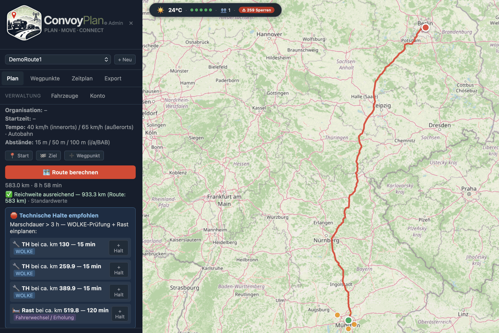
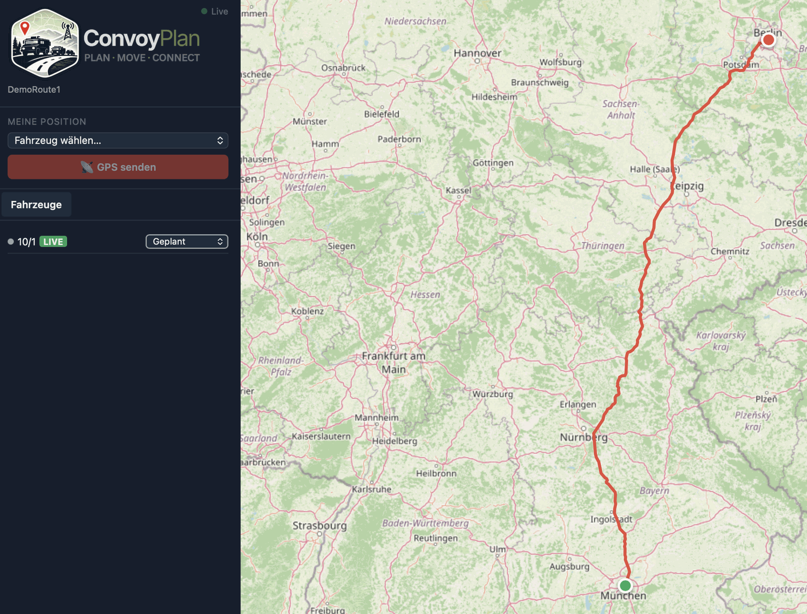
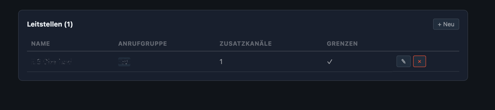
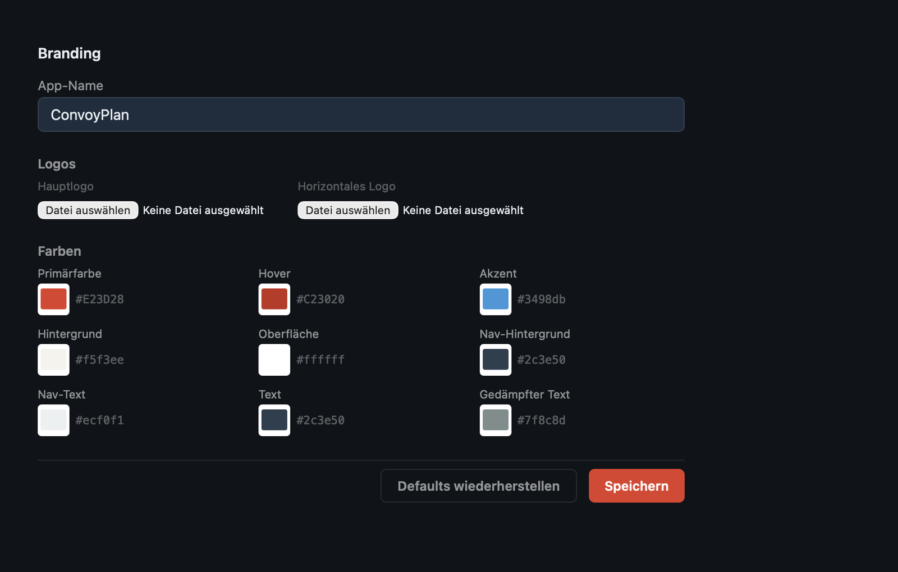

<p align="center">
  
</p>

<p align="center">
  <a href="LICENSE"></a>
  <a href="https://github.com/RettTechSolutions/ConvoyPlan/releases/latest"></a>
  <a href="https://github.com/RettTechSolutions/ConvoyPlan/actions/workflows/ci.yml"></a>
  <a href="https://github.com/RettTechSolutions/ConvoyPlan/issues"></a>
  <a href="https://github.com/RettTechSolutions/ConvoyPlan/pulls"></a>
</p>

<p align="center">
  <strong>Browserbasierte Planungssoftware für Marschverbände, Konvois und Einsatzfahrten von BOS-Organisationen.</strong>
</p>

<p align="center">
  Kartenbasierte Routenplanung · Live-Tracking · Marschbefehl-PDF · Self-hosted · Docker
</p>

<p align="center">
  
</p>

<p align="center">
  <em>Marschplanung Berlin → München: Route über GraphHopper berechnet, Distanz und Dauer (583&nbsp;km · 8&nbsp;h&nbsp;58&nbsp;min), Reichweiten-Check und automatisch empfohlene technische Halte.</em>
</p>

---

## Was ist ConvoyPlan?

ConvoyPlan ist eine selbst gehostete Web-Anwendung, die Einsatzorganisationen (BOS) bei der strukturierten Planung und Durchführung von Marschverbänden und Konvoifahrten unterstützt. Die Software läuft vollständig on-premise und erfordert keine Cloud-Dienste.

- 🗺️ **Kartenbasierte Marschplanung** mit OpenStreetMap, MapLibre GL und selbst gehostetem GraphHopper-Routing.
- 🚒 **Fahrzeug- und Verbandsverwaltung** mit Wegpunkten, Kontrollpunkten, technischen Halten und automatischer Zeitplanung.
- 📄 **Marschbefehl-PDF** sowie GPX- und JSON-Export für Weitergabe und Nachbearbeitung.
- 📡 **Live-Tracking per WebSocket** mit Fahrzeugstatus, Projektion auf die Route und Wegpunkt-/Kanalwechsel-Meldungen.
- 🌤️ **Wetter- und Verkehrsdaten** über Open-Meteo, Overpass, Autobahn-API, offene Feeds und optional HERE/TomTom.
- 🏢 **Multi-Tenancy** mit Org-Code-Slug, org-spezifischem Branding, Rollenmodell und vollständiger Datenisolation.
- 🔒 **Sicherheit & Datenschutz** – MFA/TOTP, Security-Härtung, Audit-Log, DSGVO-Werkzeuge, Backup/Restore.
- 🔄 **Auto-Updater** mit Kanälen (Stable/Beta/Nightly), Demo-Modus und Lizenzaktivierung über die Admin-UI.
- 📱 **PWA & Capacitor** für installierbare Web-App und native App-Wrapper.

> 📖 **Vollständige Feature-Übersicht mit Status und Roadmap:**
> **[Funktionsumfang](https://github.com/RettTechSolutions/ConvoyPlan/wiki/Funktionsumfang)** im Wiki.

---

## Schnellinstallation

**Linux:**

```bash
curl -sSL https://convoyplan.de/install.sh | bash
```

**Windows (PowerShell als Administrator):**

```powershell
irm https://convoyplan.de/install.ps1 | iex
```

Der Installer prüft Voraussetzungen (Docker, Docker Compose), fragt interaktiv nach Domain, E-Mail, Datenbankpasswort und OSM-Region, generiert einen `JWT_SECRET` automatisch und startet den Stack. Nach Abschluss öffnet sich der Setup-Wizard unter `https://<DOMAIN>/setup`.

> 📖 **Manuelle Installation, Konfiguration und Deployment** (Docker Compose, Portainer, alle Umgebungsvariablen):
> **[Installation und Setup](https://github.com/RettTechSolutions/ConvoyPlan/wiki/Installation-und-Setup)** im Wiki.

---

## Screenshots

<table>
  <tr>
    <td width="50%"><br><sub><b>🗺️ Marschplanung</b> – Wegpunkte, GraphHopper-Route, Reichweiten-Check, empfohlene Halte.</sub></td>
    <td width="50%"><br><sub><b>📡 Live-Tracking</b> – Position, Status und Verbandsfortschritt in Echtzeit.</sub></td>
  </tr>
  <tr>
    <td width="50%"><br><sub><b>📞 Leitstellen</b> – Anrufgruppen, Zusatzkanäle und automatische Kanalwechselpunkte.</sub></td>
    <td width="50%"><br><sub><b>🎨 Branding</b> – App-Name, Logos und Farbschema pro Organisation.</sub></td>
  </tr>
</table>

> Die Screenshots stammen aus dem Demo-Modus. Logo- und Design-Assets liegen unter [`logo/`](logo/).

---

## Dokumentation

Die vollständige Anwender- und Betriebsdokumentation liegt im **[GitHub Wiki](https://github.com/RettTechSolutions/ConvoyPlan/wiki)**.

Die Markdown-Quellen dazu liegen im Ordner [`wiki/`](wiki/). Bei jedem Push auf `main` werden sie über den Workflow [`.github/workflows/sync-wiki.yml`](.github/workflows/sync-wiki.yml) automatisch ins GitHub Wiki gespiegelt — Bearbeitungen also bitte immer in `wiki/` vornehmen, nicht direkt im Wiki.

| Seite | Inhalt |
|---|---|
| [Home](https://github.com/RettTechSolutions/ConvoyPlan/wiki/Home) | Projektübersicht, Architektur, Tech-Stack |
| [Funktionsumfang](https://github.com/RettTechSolutions/ConvoyPlan/wiki/Funktionsumfang) | Vollständige Feature-Übersicht mit Status und Roadmap |
| [Installation und Setup](https://github.com/RettTechSolutions/ConvoyPlan/wiki/Installation-und-Setup) | Docker-Quickstart, Konfiguration, Deployment |
| [API-Dokumentation](https://github.com/RettTechSolutions/ConvoyPlan/wiki/API-Dokumentation) | REST- und WebSocket-Endpunkte, Datenmodell |
| [Entwicklung](https://github.com/RettTechSolutions/ConvoyPlan/wiki/Entwicklung) | Projektstruktur, lokaler Workflow, CI/Releases |
| [Benutzerhandbuch](https://github.com/RettTechSolutions/ConvoyPlan/wiki/Benutzerhandbuch) | Anleitung für Planer, Fahrer und Admins |
| [Erste Schritte](https://github.com/RettTechSolutions/ConvoyPlan/wiki/Erste-Schritte) | Registrierung, Login und erster Überblick |
| [Konvoi-Planung](https://github.com/RettTechSolutions/ConvoyPlan/wiki/Konvoi-Planung) | Konvois anlegen, Wegpunkte und Route berechnen |
| [Fahrzeuge](https://github.com/RettTechSolutions/ConvoyPlan/wiki/Fahrzeuge) | Fahrzeuge anlegen und verwalten |
| [Live-Tracking](https://github.com/RettTechSolutions/ConvoyPlan/wiki/Live-Tracking) | Echtzeit-Verfolgung der Fahrzeuge |
| [Marschbefehl & Export](https://github.com/RettTechSolutions/ConvoyPlan/wiki/Marschbefehl-Export) | PDF-Marschbefehl sowie GPX-/JSON-Export |
| [Rollen & Berechtigungen](https://github.com/RettTechSolutions/ConvoyPlan/wiki/Rollen) | Rollenmodell und Zugriffsrechte |
| [Teilen](https://github.com/RettTechSolutions/ConvoyPlan/wiki/Teilen) | Öffentliche Freigabelinks ohne Login |
| [Verkehrsdaten](https://github.com/RettTechSolutions/ConvoyPlan/wiki/Verkehrsdaten) | Baustellen/Sperrungen und Live-Verkehrslage einrichten |
| [Multi-Tenancy](https://github.com/RettTechSolutions/ConvoyPlan/wiki/Multi-Tenancy) | Organisationen, Org-Code-Slug, Datenisolation |
| [Auto-Updater](https://github.com/RettTechSolutions/ConvoyPlan/wiki/Auto-Updater) | Update-Kanäle, Update-Modi und manueller Trigger |
| [Lizenz und Demo-Modus](https://github.com/RettTechSolutions/ConvoyPlan/wiki/Lizenz-und-Demo-Modus) | Lizenzaktivierung, Demo-Modus, Instanz-UUID |
| [Sicherheit und Datenschutz](https://github.com/RettTechSolutions/ConvoyPlan/wiki/Sicherheit-und-Datenschutz) | Härtung, Audit-Log, DSGVO, Backup/Restore, Retention |
| [FAQ](https://github.com/RettTechSolutions/ConvoyPlan/wiki/FAQ) | Häufige Fragen |

---

## Lizenz

ConvoyPlan wird unter einem **Dual-Lizenz-Modell** veröffentlicht:

- **Open Source — AGPL-3.0:** Der Quelltext steht unter der [GNU Affero General Public License v3.0](LICENSE). Wer ConvoyPlan nutzt, modifiziert oder als Dienst betreibt, muss eigene Änderungen ebenfalls unter AGPL-3.0 veröffentlichen. Diese Lizenz gilt für interne, nicht-kommerzielle oder vollständig quelloffene Nutzung.
- **Kommerzielle Lizenz:** Für Organisationen, die ConvoyPlan in proprietäre Produkte einbetten, als SaaS betreiben oder Änderungen nicht veröffentlichen möchten — ohne Copyleft-Pflichten. Details in [COMMERCIAL_LICENSE.md](COMMERCIAL_LICENSE.md), Anfragen an **anfrage@convoyplan.de**.

---

## Beitragen

Pull Requests sind willkommen. Bitte öffne zuerst ein Issue für größere Änderungen.

Alle Beiträge unterliegen dem [Contributor License Agreement (CLA)](CLA.md), das durch das Einreichen eines Pull Requests automatisch akzeptiert wird. Die CLA stellt sicher, dass Beiträge sowohl unter AGPL-3.0 als auch im Rahmen kommerzieller Lizenzen genutzt werden können.

---

<p align="center">
  <strong>ConvoyPlan</strong> – strukturierte Marschverbandsplanung für moderne Einsatzorganisationen.
</p>
