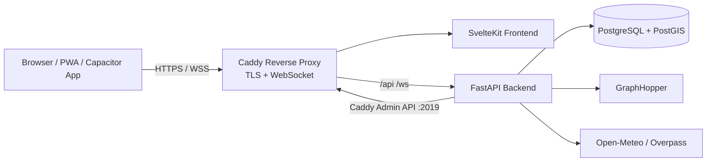

<p align="center">
  
</p>

# MarschPlan

**MarschPlan ist eine browserbasierte Planungssoftware für Marschverbände, Konvois und Einsatzfahrten von BOS-Organisationen.**

Die Anwendung unterstützt Planerinnen und Planer dabei, Fahrzeuge zu verwalten, Marschrouten auf Basis von OpenStreetMap zu erstellen, Wegpunkte und technische Halte zu strukturieren, Zeitpläne automatisch zu berechnen und Marschbefehle als PDF, GPX oder JSON zu exportieren. Live-Tracking, Wetterdaten, Sperrungsinformationen und GeoJSON-Lagedaten machen MarschPlan zu einer zentralen Lage- und Planungsoberfläche für Übungen, Einsätze und Verlegungen.

---

## Inhaltsverzeichnis

- [Highlights](#highlights)
- [Funktionsumfang](#funktionsumfang)
- [Screenshots und Assets](#screenshots-und-assets)
- [Architektur](#architektur)
- [Tech-Stack](#tech-stack)
- [Projektstruktur](#projektstruktur)
- [Quickstart](#quickstart)
- [Konfiguration](#konfiguration)
- [API-Übersicht](#api-übersicht)
- [Datenmodell](#datenmodell)
- [Entwicklung](#entwicklung)
- [Deployment](#deployment)
- [Native App / PWA](#native-app--pwa)
- [Sicherheitshinweise](#sicherheitshinweise)
- [Roadmap-Ideen](#roadmap-ideen)
- [Lizenz](#lizenz)

---

## Highlights

- **Kartenbasierte Marschplanung** mit OpenStreetMap und MapLibre GL.
- **Routing über GraphHopper** inklusive selbst gehosteter Routing-Engine im Docker-Setup.
- **Fahrzeugverwaltung** mit Funkrufname, Kennzeichen, Abmessungen, Gewicht, Rolle und Kraftstoffdaten.
- **Wegpunkte, Kontrollpunkte und technische Halte** inklusive Haltezeiten und Zweck wie Tanken, Pause oder Wartung.
- **Automatische Zeitplanung** anhand von Startzeit, Marschgeschwindigkeiten und Halten.
- **Marschbefehl-PDF** sowie GPX- und JSON-Export für Weitergabe und Nachbearbeitung.
- **Live-Tracking per WebSocket** mit Browser-Geolocation und Fahrzeugstatus.
- **Organisations- und Rollenmodell** für Admins, Planer, Fahrer und Beobachter.
- **Wetter- und Overpass-Integration** für Wetterdaten, Sperrungen und Baustellen.
- **PWA und Capacitor-Konfiguration** für installierbare Web-App und native App-Wrapper.

---

## Funktionsumfang

### Planung und Routing

| Funktion | Beschreibung | Status |
|---|---|---:|
| Karte | Interaktive OSM-Karte mit Planungsansicht | ✅ |
| Wegpunkte | Start, Ziel, Wegpunkte, Kontrollpunkte und technische Halte | ✅ |
| Routenberechnung | GraphHopper-Routing über selbst gehosteten Dienst | ✅ |
| Zeitplan | Automatische Ankunfts- und Abfahrtszeiten | ✅ |
| Marschgeschwindigkeiten | Separate innerörtliche und außerörtliche Geschwindigkeit | ✅ |
| Kraftstoffplanung | Fahrzeugdaten und Tankstellenabfrage entlang der Route | ✅ |

### Verwaltung und Zusammenarbeit

| Funktion | Beschreibung | Status |
|---|---|---:|
| Login | Registrierung und JWT-basierte Authentifizierung | ✅ |
| Fahrzeuge | CRUD für Einsatzfahrzeuge und Konvoirollen | ✅ |
| Marschverbände | CRUD für Konvois und zugeordnete Fahrzeuge | ✅ |
| Teilverbände | Sub-Convoys mit Parent-Konvoi | ✅ |
| Mandanten | Organisationen mit Mitgliederverwaltung | ✅ |
| Rollen | Admin, Planer, Fahrer und Beobachter | ✅ |
| Freigabelink | Öffentliche Routenansicht per Share-Token | ✅ |

### Live, Lage und Export

| Funktion | Beschreibung | Status |
|---|---|---:|
| Live-Tracking | Positionsupdates per REST und WebSocket | ✅ |
| Fahrzeugstatus | Geplant, unterwegs, angekommen oder verspätet | ✅ |
| Wetter | Integration über Open-Meteo ohne API-Key | ✅ |
| Sperrungen | Abfrage von OSM-Daten über Overpass API | ✅ |
| Lagedaten | GeoJSON-Layer hochladen, anzeigen und verwalten | ✅ |
| PDF | Marschbefehl als PDF | ✅ |
| GPX / JSON | Export für Navigation, Dokumentation und Weiterverarbeitung | ✅ |
| PWA | Installierbare Web-App mit Tile-Caching | ✅ |
| Native Wrapper | Capacitor-Konfiguration für Android und iOS | ✅ |

---

## Screenshots und Assets

Im Repository liegen bereits Logo- und Design-Assets unter [`logo/`](logo/):

| Asset | Datei |
|---|---|
| Hauptlogo | `logo/Hauptlogo.svg` / `logo/Hauptlogo.png` |
| Horizontales Logo | `logo/Logo Horizontal.svg` / `logo/Logo Horizontal.png` |
| Favicon | `logo/Favicon.svg` / `logo/Favicon.png` |
| Designgrafik | `logo/ConvoyPlan_Design.png` |

> Tipp für GitHub: Screenshots der Planungsansicht, Tracking-Ansicht und PDF-Ausgabe können später in `docs/screenshots/` abgelegt und hier eingebunden werden.

---

## Architektur

MarschPlan besteht aus fünf Kernbausteinen:



- **Caddy** terminiert TLS (Let's Encrypt oder eigenes Zertifikat), leitet `/api/*` und `/ws/*` ans Backend und alles andere ans Frontend. Die Konfiguration kann per Admin-API live neu geladen werden.
- Das **Frontend** stellt Login, Setup-Wizard, Planung, Karte, Live-Tracking und öffentliche Freigabelinks bereit.
- Das **Backend** bündelt Authentifizierung, Geschäftslogik, Routing-Aufbereitung, Exporte, Integrationen und die Caddy-Konfiguration.
- **PostgreSQL mit PostGIS** speichert Nutzer, Fahrzeuge, Konvois, Geometrien, Positionen, Lagedaten und Systemeinstellungen.
- **GraphHopper** läuft selbst gehostet und verarbeitet beim ersten Start die gewählte OSM-PBF-Datei.

---

## Tech-Stack

| Schicht | Technologie |
|---|---|
| Frontend | SvelteKit, Svelte 5, TypeScript, Vite |
| Karte | MapLibre GL, OpenStreetMap |
| PWA | `@vite-pwa/sveltekit`, Workbox |
| Native App | Capacitor-Konfiguration |
| Backend | Python 3.12, FastAPI, Uvicorn |
| Datenbank | PostgreSQL 15, PostGIS |
| ORM / Migrationen | SQLAlchemy Async, Alembic |
| Authentifizierung | JWT, `python-jose`, `passlib` |
| Routing | GraphHopper 9.1 |
| Geodaten | GeoAlchemy2, Shapely, GeoJSON |
| Exporte | GPXPy, fpdf2, JSON |
| Externe Daten | Open-Meteo, OpenStreetMap Overpass API |
| Reverse Proxy / TLS | Caddy 2 (Let's Encrypt, eigenes Zertifikat, intern) |
| Infrastruktur | Docker Compose, Portainer Stack |

---

## Projektstruktur

```text
MarschPlan/
├── backend/
│   ├── app/
│   │   ├── api/routes/       # REST- und WebSocket-Endpunkte
│   │   │   ├── auth.py       # Registrierung, Login
│   │   │   ├── setup.py      # Ersteinrichtungs-Wizard (Status + Ausführen)
│   │   │   ├── admin.py      # Superadmin-Benutzerverwaltung
│   │   │   ├── convoys.py    # Marschverbände, Waypoints, Export
│   │   │   ├── vehicles.py   # Fahrzeugverwaltung
│   │   │   ├── organizations.py  # Organisationen und Mitglieder
│   │   │   ├── tracking.py   # Live-Positionen + WebSocket
│   │   │   ├── routing.py    # GraphHopper-Routing
│   │   │   ├── lage.py       # GeoJSON-Lagedaten
│   │   │   ├── weather.py    # Open-Meteo-Integration
│   │   │   ├── overpass.py   # OSM-Sperrungsabfragen
│   │   │   ├── users.py      # Eigenes Benutzerprofil
│   │   │   └── status.py     # Systemstatus
│   │   ├── models/           # SQLAlchemy-Modelle
│   │   ├── schemas/          # Pydantic-Schemas
│   │   ├── services/         # Routing, Zeitplan, Export, Wetter, Tracking
│   │   ├── config.py         # Backend-Konfiguration über Umgebungsvariablen
│   │   ├── database.py       # Async-Datenbankanbindung
│   │   └── main.py           # FastAPI-App und Router-Registrierung
│   ├── alembic/              # Datenbankmigrationen (0001–0008)
│   ├── tests/                # pytest-Tests
│   ├── Dockerfile
│   └── requirements.txt
├── frontend/
│   ├── src/lib/api/          # API-Client
│   ├── src/lib/components/   # Karte, Wetter, Lagedatenpanel
│   ├── src/lib/stores/       # Auth-, Karten-, Konvoi-, Tracking-Stores
│   ├── src/routes/
│   │   ├── setup/            # Ersteinrichtungs-Wizard (3 Schritte)
│   │   ├── login/            # Anmeldung
│   │   ├── plan/             # Planungsansicht mit Karte
│   │   ├── tracking/         # Live-Tracking-Ansicht
│   │   ├── share/            # Öffentliche Routenansicht
│   │   └── admin/            # Superadmin-Benutzerverwaltung
│   ├── capacitor.config.ts
│   ├── package.json
│   └── vite.config.ts
├── caddy/
│   └── entrypoint.sh         # Caddyfile-Generierung aus Env-Variablen (Fallback vor Setup)
├── graphhopper/
│   ├── Dockerfile
│   ├── entrypoint.sh         # OSM-Download und GraphHopper-Start
│   └── config.yml
├── .github/workflows/
│   ├── ci.yml                # Backend-Tests + Frontend-Check + Docker-Build bei Push/PR
│   └── release.yml           # Docker-Images zu GHCR + GitHub Release bei v*.*.*-Tag
├── .hooks/pre-commit         # Lokaler Pre-Commit-Hook (ruff + svelte-check)
├── scripts/install-hooks.sh  # Installiert .hooks/ in .git/hooks/
├── logo/                     # Logo-, Favicon- und Design-Assets
├── docs/                     # Spezifikationen und Implementierungspläne
├── CHANGELOG.md              # Versionshistorie
├── RELEASING.md              # Anleitung zum Schneiden eines Releases
├── .env.example              # Alle Umgebungsvariablen mit Erklärungen
├── docker-compose.yml        # Lokales Entwicklungssetup
└── portainer-stack.yml       # Produktivstack für Portainer
```

---

## Quickstart

### Voraussetzungen

- Git
- Docker und Docker Compose Plugin
- Node.js 20+ und npm für das Frontend
- Optional: Python 3.12 für lokale Backend-Entwicklung ohne Container

### 1. Repository klonen

```bash
git clone https://github.com/RettTechSolutions/MarschPlan.git
cd MarschPlan
```

### 2. Backend, Datenbank und GraphHopper starten

```bash
docker compose up -d --build
```

Beim ersten Start lädt GraphHopper die konfigurierte OSM-PBF-Datei herunter und baut daraus den Routing-Graphen. Der Standard ist Deutschland und kann mehrere Gigabyte groß sein. Für schnelle lokale Tests empfiehlt sich eine kleinere Region wie Berlin.

Logs verfolgen:

```bash
docker compose logs -f graphhopper
```

Gesundheitschecks prüfen:

```bash
curl http://localhost:8000/health
curl http://localhost:8989/health
```

### 3. Kleinere Testregion konfigurieren

Für einen schnelleren Start kann in `docker-compose.yml` beispielsweise Berlin gesetzt werden:

```yaml
OSM_DOWNLOAD_URL: https://download.geofabrik.de/europe/germany/berlin-latest.osm.pbf
OSM_FILENAME: berlin-latest.osm.pbf
```

Nach einer Änderung der OSM-Datei sollte der GraphHopper-Graph-Cache neu aufgebaut werden:

```bash
docker compose down
docker volume rm marschplan_gh_graph
docker compose up -d --build
```

### 4. Frontend starten

```bash
cd frontend
npm install
npm run dev
```

Die Anwendung ist anschließend erreichbar unter:

- Frontend: <http://localhost:5173>
- Backend API: <http://localhost:8000>
- Swagger UI: <http://localhost:8000/docs>
- GraphHopper: <http://localhost:8989>

### 5. Setup-Wizard ausführen

Beim ersten Start leitet die Anwendung automatisch auf `http://localhost:5173/setup` weiter. Der dreistufige Wizard führt durch:

1. **Superadmin-Account** — E-Mail-Adresse und Passwort festlegen.
2. **Domain und SSL** — Serverdomain (FQDN) eingeben und TLS-Modus wählen: Let's Encrypt, eigenes Zertifikat (Datei-Upload) oder internes Zertifikat für lokale Nutzung.
3. **Abschluss** — Caddy wird live neu geladen; danach direkt zur Anmeldung.

> Für lokale Entwicklung ohne Caddy (reiner `npm run dev`-Modus) kann der Wizard mit `localhost` als Domain und `internal` als TLS-Modus ausgeführt werden.

---

## Konfiguration

Eine vollständige Vorlage liegt in `.env.example`. Die wichtigsten Variablen:

### Datenbank

| Variable | Beschreibung |
|---|---|
| `POSTGRES_USER` | Datenbankbenutzer |
| `POSTGRES_PASSWORD` | Datenbankpasswort – in Produktion ändern |
| `POSTGRES_DB` | Datenbankname |

### Backend

| Variable | Standard | Beschreibung |
|---|---|---|
| `DATABASE_URL` | *(wird aus POSTGRES_\* zusammengesetzt)* | PostgreSQL/PostGIS-Verbindung |
| `JWT_SECRET` | `changeme-in-production` | Signaturschlüssel für JWTs – in Produktion zwingend ersetzen (`openssl rand -hex 32`) |
| `JWT_ALGORITHM` | `HS256` | JWT-Algorithmus |
| `JWT_EXPIRE_MINUTES` | `10080` | Token-Ablaufzeit in Minuten (7 Tage) |
| `GRAPHHOPPER_URL` | `http://graphhopper:8989` | URL der Routing-Engine |
| `CORS_ORIGINS` | `*` | Erlaubte CORS-Origins; in Produktion auf die eigene Domain einschränken |

### SSL / Caddy

Domain und Zertifikat werden beim ersten Start über den Setup-Wizard in der Datenbank gespeichert und als Caddyfile auf einem geteilten Volume abgelegt. Die folgenden Variablen gelten als Fallback für den allerersten Container-Start vor dem Wizard:

| Variable | Beschreibung |
|---|---|
| `DOMAIN` | Serverdomain (z. B. `convoy.example.com`), Standard: `localhost` |
| `ACME_EMAIL` | E-Mail für Let's Encrypt, Standard: `admin@example.com` |
| `CADDY_TLS_CERT` | Pfad zum PEM-Zertifikat (optional, für eigene Zertifikate) |
| `CADDY_TLS_KEY` | Pfad zum PEM-Schlüssel (optional, für eigene Zertifikate) |
| `HTTP_PORT` | Externer HTTP-Port, Standard: `80` |
| `HTTPS_PORT` | Externer HTTPS-Port, Standard: `443` |

### GraphHopper

| Variable | Standard | Beschreibung |
|---|---|---|
| `OSM_DOWNLOAD_URL` | `https://download.geofabrik.de/europe/germany-latest.osm.pbf` | Download-URL der OSM-PBF-Datei |
| `OSM_FILENAME` | `germany-latest.osm.pbf` | Dateiname im persistenten OSM-Volume |
| `JAVA_OPTS` | `-Xmx2g -Xms512m -XX:+UseG1GC` | JVM-Speicherkonfiguration |

### Frontend (lokale Entwicklung)

Für lokale Entwicklung ohne Caddy kann `frontend/.env.local` angelegt werden:

```env
# WebSocket-Host überschreiben, wenn kein Caddy läuft
VITE_WS_HOST=localhost:8000
```

---

## API-Übersicht

Die vollständige OpenAPI-Dokumentation wird automatisch von FastAPI bereitgestellt:

- Swagger UI: <http://localhost:8000/docs>
- OpenAPI JSON: <http://localhost:8000/openapi.json>

**Ersteinrichtung**

| Methode | Endpunkt | Beschreibung |
|---|---|---|
| `GET` | `/api/setup/status` | Prüft ob Setup erforderlich ist (kein Superadmin vorhanden) |
| `POST` | `/api/setup` | Superadmin anlegen, Domain und TLS konfigurieren, Caddy live neu laden |

**Authentifizierung**

| Methode | Endpunkt | Beschreibung |
|---|---|---|
| `POST` | `/api/auth/register` | Account erstellen |
| `POST` | `/api/auth/login` | Login und JWT erhalten |

**Superadmin-Verwaltung**

| Methode | Endpunkt | Beschreibung |
|---|---|---|
| `GET` | `/api/admin/users` | Alle Benutzer auflisten (Superadmin) |
| `PATCH` | `/api/admin/users/{user_id}` | Benutzer aktivieren/deaktivieren, Superadmin-Flag setzen |

**Fahrzeuge und Konvois**

| Methode | Endpunkt | Beschreibung |
|---|---|---|
| `GET/POST/PUT/DELETE` | `/api/vehicles/` | Fahrzeuge verwalten |
| `GET/POST/PUT/DELETE` | `/api/convoys/` | Marschverbände verwalten |
| `POST/DELETE` | `/api/convoys/{convoy_id}/vehicles` | Fahrzeuge einem Konvoi zuordnen oder entfernen |
| `GET/POST/PUT/DELETE` | `/api/convoys/{convoy_id}/waypoints` | Wegpunkte verwalten |
| `GET/POST` | `/api/convoys/{convoy_id}/sub-convoys` | Teilverbände anzeigen oder erstellen |
| `POST` | `/api/convoys/{convoy_id}/calculate-route` | Route und Zeitplan berechnen |
| `GET` | `/api/convoys/{convoy_id}/export/gpx` | GPX exportieren |
| `GET` | `/api/convoys/{convoy_id}/export/json` | JSON exportieren |
| `GET` | `/api/convoys/{convoy_id}/export/pdf` | Marschbefehl als PDF exportieren |
| `GET` | `/api/convoys/{convoy_id}/fuel-stations` | Tankstellen entlang der Route abrufen |
| `GET` | `/api/convoys/share/{token}` | Öffentliche Routenansicht abrufen |

**Organisationen**

| Methode | Endpunkt | Beschreibung |
|---|---|---|
| `GET/POST/DELETE` | `/api/organizations/` | Organisationen und Mitglieder verwalten |

**Live-Tracking**

| Methode | Endpunkt | Beschreibung |
|---|---|---|
| `GET/POST` | `/api/convoys/{convoy_id}/positions` | Live-Positionen abrufen oder aktualisieren |
| `PATCH` | `/api/convoys/{convoy_id}/vehicles/{vehicle_id}/status` | Fahrzeugstatus ändern |
| `WS` | `/ws/tracking/{convoy_id}?token=...` | WebSocket für Live-Tracking |

**Lage, Wetter und Overpass**

| Methode | Endpunkt | Beschreibung |
|---|---|---|
| `GET/POST/PUT/DELETE` | `/api/convoys/{convoy_id}/lage` | GeoJSON-Lagedaten verwalten |
| `GET` | `/api/weather/?lat=...&lon=...` | Wetterdaten abrufen |
| `GET` | `/api/overpass/closures?lat=...&lon=...` | Sperrungen und Baustellen abrufen |

---

## Datenmodell

```text
User
├── Vehicles
├── Convoys
└── UserOrganizations

Organization
└── UserOrganizations

Convoy
├── parent_convoy_id        # Teilverband / Sub-Convoy
├── organization_id         # Mandant / Organisation
├── ConvoyVehicles          # Fahrzeugzuordnung inkl. Status
├── Waypoints               # Wegpunkte, Kontrollpunkte, technische Halte
├── Route                   # Liniengeometrie, Distanz, Dauer, GPX
├── VehiclePositions        # Live-Tracking-Positionen
└── LageLayers              # GeoJSON-Lagedaten
```

Wichtige fachliche Objekte:

- **User**: Account für Login und Besitz von Fahrzeugen/Konvois.
- **Organization**: Mandant für organisationsbezogene Planung und Rollen.
- **Vehicle**: Fahrzeug mit Funkrufname, Kennzeichen, Abmessungen, Gewicht und Kraftstoffdaten.
- **Convoy**: Marschverband mit Start-/Zielpunkt, Marschbefehl-Feldern, Share-Token und Status.
- **Waypoint**: Wegpunkt, Stopp, Kontrollpunkt oder technischer Halt mit Zeitplanung.
- **Route**: Berechnete Route inklusive Geometrie, Distanz, Dauer und Exportdaten.
- **VehiclePosition**: Aktuelle Fahrzeugposition innerhalb eines Konvois.
- **LageLayer**: Zusätzliche GeoJSON-Lageinformationen.

---

## Entwicklung

### Backend lokal entwickeln

```bash
cd backend
python -m venv .venv
source .venv/bin/activate
pip install -r requirements.txt
alembic upgrade head
uvicorn app.main:app --reload
```

> Hinweis: Für lokale Backend-Entwicklung müssen PostgreSQL/PostGIS und GraphHopper erreichbar sein. Am einfachsten laufen diese weiterhin über Docker Compose.

### Frontend prüfen und bauen

```bash
cd frontend
npm install
npm run check
npm run build
```

### Datenbankmigrationen

Aktuelle Migrationen ausführen:

```bash
cd backend
alembic upgrade head
```

Neue Migration erzeugen:

```bash
cd backend
alembic revision --autogenerate -m "beschreibung"
```

### Nützliche Docker-Befehle

```bash
# Stack starten
docker compose up -d --build

# Logs anzeigen
docker compose logs -f backend

# Services stoppen
docker compose down

# Persistente Daten inklusive OSM-/GraphHopper-Cache entfernen
docker compose down -v
```

---

## Deployment

### Produktivsetup (Docker Compose / Portainer)

1. `.env.example` als `.env` kopieren und anpassen:
   ```bash
   cp .env.example .env
   # JWT_SECRET, POSTGRES_PASSWORD, DOMAIN, ACME_EMAIL setzen
   ```

2. Stack starten:
   ```bash
   docker compose -f docker-compose.yml up -d --build
   ```

3. Im Browser `https://<DOMAIN>/setup` aufrufen und den Setup-Wizard abschließen. Caddy wird danach automatisch mit dem konfigurierten Zertifikat neu geladen.

### Portainer

Eine fertige Stack-Konfiguration liegt in `portainer-stack.yml`. Images werden dort über Variablen gesetzt; der Setup-Wizard übernimmt die Erstkonfiguration von Domain und Zertifikat.

### Empfehlungen für Produktion

1. `JWT_SECRET` mit `openssl rand -hex 32` generieren und nicht in Git versionieren.
2. Datenbankpasswort ändern.
3. `CORS_ORIGINS` auf die produktive Domain einschränken.
4. Persistente Volumes (`postgres_data`, `caddy_data`, `cert_uploads`) regelmäßig sichern.
5. Für große OSM-Regionen (Deutschland: ~4 GB) ausreichend RAM (`JAVA_OPTS=-Xmx4g`) und Speicherplatz einplanen.
6. GraphHopper-Graph-Cache (`gh_graph`) auf schnellem Speicher ablegen – erster Build dauert mehrere Minuten.

### CI und Releases

CI-Checks (Backend-Tests, Frontend-Typecheck, Docker-Build) laufen automatisch auf Push und Pull Requests gegen `main`.

Für ein neues Release den Tag `vX.Y.Z` setzen – Docker-Images werden dann automatisch zu GHCR gebaut und gepusht; ein GitHub Release wird erstellt. Vollständige Anleitung in [`RELEASING.md`](RELEASING.md).

---

## Native App / PWA

Das Frontend ist als Progressive Web App konfiguriert und kann im Browser installiert werden. Zusätzlich ist Capacitor vorbereitet.

Native Wrapper bauen:

```bash
cd frontend
npm run build
npx cap add android   # einmalig, alternativ: ios
npx cap sync
npx cap open android
```

Für iOS wird eine macOS-Umgebung mit Xcode benötigt.

---

## Sicherheitshinweise

- Der Standardwert `changeme-in-production` für `JWT_SECRET` ist nur für lokale Entwicklung gedacht.
- Die Datenbankzugänge in `docker-compose.yml` sind Entwicklungs-Defaults und nicht produktionsgeeignet.
- Die Caddy-Admin-API läuft auf Port `:2019` und ist im Docker-Netzwerk intern erreichbar. Der Port wird nicht nach außen exponiert (`ports:` fehlt bewusst in der Caddy-Service-Definition). In Multi-Tenant-Umgebungen mit nicht vertrauenswürdigen Containern sollte das gesondert abgesichert werden.
- Live-Tracking verarbeitet Standortdaten. Für reale Einsätze sollten Zugriff, Aufbewahrung, Protokollierung und Löschung organisatorisch geregelt werden.
- Öffentliche Share-Links sind ohne Login abrufbar. Tokens sollten wie vertrauliche Links behandelt werden.
- Externe Dienste (Open-Meteo, Overpass, Geofabrik) können Verfügbarkeit, Limits oder Nutzungsbedingungen haben.

---

## Roadmap-Ideen

Diese Punkte sind mögliche nächste Ausbauschritte:

- Import vorhandener GPX-/GeoJSON-Routen.
- Rechte- und Rollenprüfung pro Organisation weiter verfeinern.
- Benachrichtigungen bei Verzögerungen oder Abweichungen von der Route.
- Audit-Log für Änderungen an Marschbefehlen und Konvois.
- Offline-First-Synchronisation für mobile Nutzung.
- ~~CI-Pipeline für Backend-Tests, Frontend-Checks und Docker-Builds~~ ✅ (seit 0.4.0)
- Erweiterte Einsatzdokumentation und Einsatznachbereitung.

---

## Lizenz

Dieses Projekt steht unter der MIT-Lizenz.

---

<p align="center">
  <strong>MarschPlan</strong> – strukturierte Marschverbandsplanung für moderne Einsatzorganisationen.
</p>
